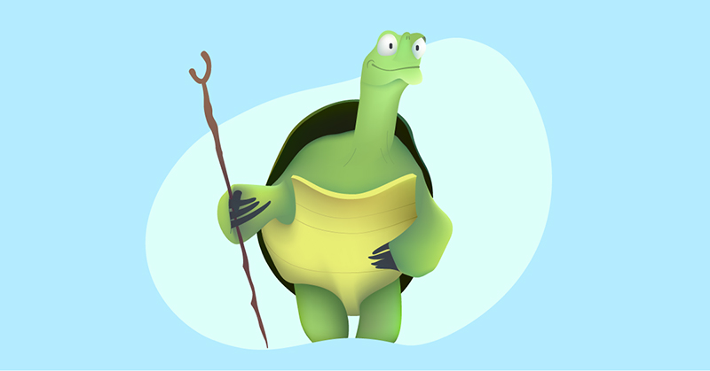

# Exercice Accessibilité, schema.org  &amp;  SEO

Cette page de Blog utilise ces deux schemas  : **_Blog et Comment_** .
Vous trouverez un **_Open graph_** pour faciliter convergence des internautes sur les réseaux sociaux.

L'exercice sera noté exclusivement sur gitHub.
[Voir la page](https://bcollignonecv.github.io/TP-semantic/ "blog")